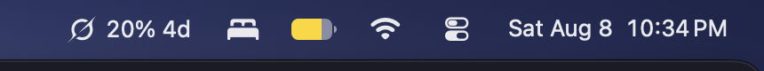
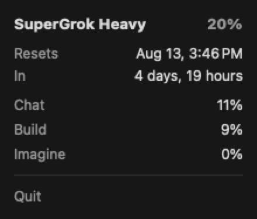
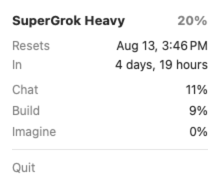

# GrokBar

<p align="center">
  
</p>

<p align="center">
  <strong>Weekly Grok usage at a glance</strong> — plan, pool %, and time until reset in your Mac menu bar.
</p>

<p align="center">
  
  
  
</p>

Unofficial menu bar utility for [Grok](https://grok.com) / [Grok Build](https://x.ai/build). Reads the same local login as the Grok CLI (`~/.grok/auth.json`) and fetches **billing metadata only** — no chat or model calls.

---

## Screenshots

**Menu bar**


**Detail panel**

<p align="center">
  
  &nbsp;&nbsp;
  
</p>

### Menu bar

```
✦  20% 4d
```

| Piece | Meaning |
|-------|---------|
| **Grok mark** | Template icon (adapts to light/dark menu bar) |
| **Usage** | Weekly pool percent used |
| **Countdown** | Days until reset when ≥ 24h remain; otherwise hours |
| **`⚠`** | Active issue on [status.x.ai](https://status.x.ai/) (may appear with usage: `⚠ 20% 4d`) |
| **`—`** | Not signed in / Grok not set up yet (app still runs) |
| **`!`** | Temporary fetch error with no cached data |

### Click for details

- **Plan** (e.g. SuperGrok Heavy) and total **% used**
- **Weekly reset** date/time (no year) and countdown in **days + hours**
- **Usage split** by product — Chat, Build, Imagine, Voice, API
- **Outage banner** when xAI declares an incident (link to status.x.ai)
- **Quit**

---

## Requirements

- **macOS 14** or later  
- **[Grok Build](https://x.ai/build)** installed and signed in at least once for live usage numbers  

```bash
grok login   # only if ~/.grok/auth.json is missing
```

GrokBar still launches without Grok: it shows `—` and a short setup hint until you sign in.

---

## Install

### Build from source

```bash
git clone https://github.com/rlimberger/grokbar.git
cd grokbar
bash build.sh
open "build/GrokBar.app"
```

Recommended install path (stable for Launch at Login):

```bash
cp -R "build/GrokBar.app" /Applications/
open /Applications/GrokBar.app
```

**Launch at Login** is enabled automatically on first run (no toggle). If macOS asks for approval, allow GrokBar under **System Settings → General → Login Items**.

Ad-hoc signed builds: first open via **right-click → Open** if Gatekeeper warns.

Xcode (or Xcode-beta) must be available for the Swift toolchain / SDK.

### App icon

The Dock/Finder icon is the Grok mark plus a menu-bar usage meter. Regenerate assets after design changes:

```bash
bash scripts/render_app_icon.sh
bash build.sh
```

---

## Behavior

| Situation | What you see |
|-----------|----------------|
| Signed in, healthy | `✦ 20% 4d` + full detail panel |
| Not signed in / no `~/.grok` | `—` + setup hint; re-checks every ~2 minutes |
| Session expired | `—` + “run `grok login`”; cache cleared so stale % isn’t shown |
| Network blip | Last good snapshot kept in the menu bar |
| Active xAI incident | `⚠` (and banner in the panel) via [status.x.ai/feed.xml](https://status.x.ai/feed.xml) |

Background refresh is about **every 20 minutes** when healthy, **~5 minutes** during a declared outage, and **~2 minutes** while waiting for setup. Opening the panel refreshes if data is older than **15 minutes**. The countdown ticks locally every minute without a network call.

---

## Privacy

| Action | Detail |
|--------|--------|
| **Read** | `~/.grok/auth.json` (shared with Grok Build) |
| **Write** | May refresh OIDC tokens in that file |
| **Network** | `auth.x.ai` (token refresh), `cli-chat-proxy.grok.com` (billing metadata), `status.x.ai/feed.xml` (public outage feed) |
| **Not sent** | Chats, code, project files |

No inference / completions — only usage, subscription metadata, and public status-page data.

---

## How it works

1. Load OIDC credentials from `~/.grok/auth.json` (same file as `grok`).
2. Refresh the access token when near expiry (`auth.x.ai/oauth2/token`).
3. Fetch billing metadata:
   - `GET …/v1/billing?format=credits` — weekly pool %, product split, reset window  
   - `GET …/v1/billing` — monthly included allowance (plan heuristics)
4. In parallel, fetch the public xAI status RSS feed for declared incidents.
5. Cache the last good usage snapshot under Application Support.
6. Register as a login item via `SMAppService` on each launch (best-effort).

Plan names are **best-effort** (OIDC `tier` claim + monthly included pool). xAI does not always return a stable plan string on this endpoint.

---

## Project layout

```
Sources/                 Status item, panel, auth, usage + status fetchers
Resources/               Info.plist, AppIcon.icns, Grok menu-bar template icons
Assets.xcassets/         App icon sizes
scripts/                 render_app_icon.sh — regenerate AppIcon assets
docs/screenshots/        README images
build.sh                 → build/GrokBar.app
```

---

## License

[MIT](LICENSE)

Not affiliated with xAI. Grok and related marks are property of their owners.
